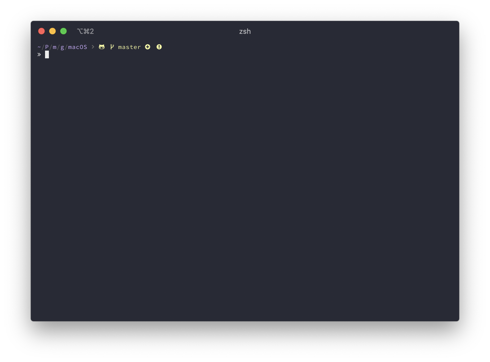
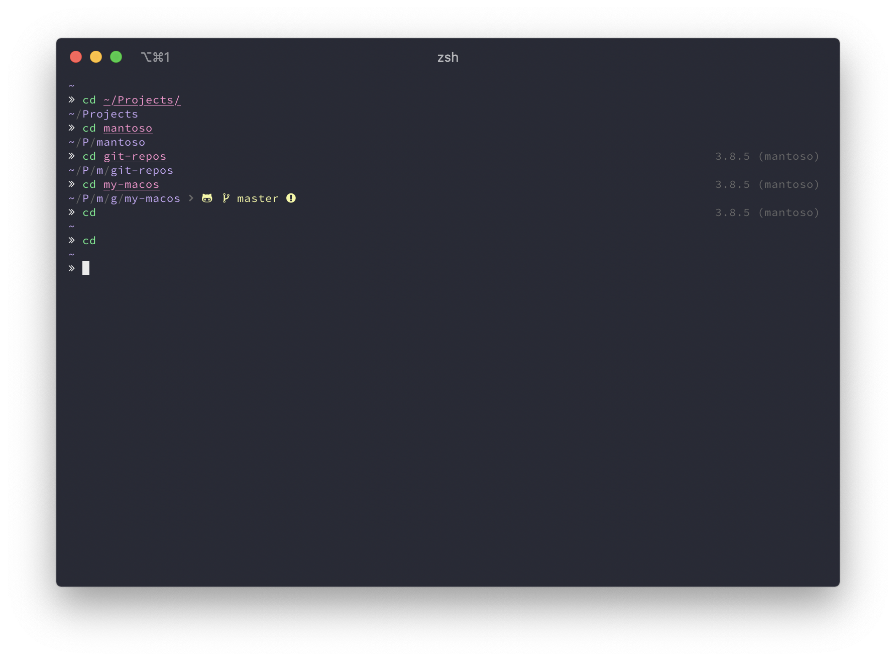

= macOS Setup
ifdef::env-github[]
:tip-caption: :bulb:
:note-caption: :information_source:
:important-caption: :heavy_exclamation_mark:
:caution-caption: :fire:
:warning-caption: :warning:
endif::[]
:toc:
:toc-placement: preamble
:toclevels: 1
// URI's
:uri-homebrew: https://brew.sh
:uri-mantoso-role-homebrew: https://github.com/mantoso/mantoso-role-homebrew
:uri-setup-dotfiles: https://gist.github.com/tracphil/03de0b546e83372141aea36772ba844c
:uri-my-zsh: https://github.com/tracphil/my-zsh
:uri-powerlevel10k: https://github.com/romkatv/powerlevel10k
:uri-gnupg: https://gnupg.org/
== Frontmatter

This is the general steps in order that I use to setup a new Mac

== Homebrew

Install {uri-homebrew}[Homebrew] via the CLI

[source,bash]
----
/bin/bash -c "$(curl -fsSL https://raw.githubusercontent.com/Homebrew/install/master/install.sh)"
----

== Ansible

=== Install Ansible

----
sudo easy_install pip
sudo pip install ansible
----

=== Ansible Directory Structure

----
mkdir -p ~/Projects/ansible/roles
cd $USER/Projects/ansible
----

----
cat > ansible.cfg <<EOF
[defaults]
inventory = localhost
EOF
----

----
cat > localhost <<EOF
[localhost]
127.0.0.1  ansible_connection=local
----

=== Clone homebrew role

I clone {uri-mantoso-role-homebrew}[mantoso-role-homebrew] via ssh, you might want to clone via https

----
git clone git@github.com:mantoso/mantoso-role-homebrew.git $USER/Projects/ansible/roles
----

=== Create the playbook

----
cp roles/mantoso-role-homebrew/homebrew-playbook-example.yml homebrew-playbook.yml
----

Or if you are ok with the example playbook, create a symlink to it:

----
ln -s $(pwd)/roles/mantoso-role-homebrew/homebrew-playbook-example.yml $(pwd)/homebrew-playbook.yml
----

=== Run ansible-playbook

----
ansible-playbook --ask-become-pass homebrew-playbook.yml
----

== Dotfiles

I have {uri-setup-dotfiles}[a script] to symlink dotfiles that I store in iCloud so that my dotfiles are in sync across all my Macs.

----
mkdir -p ~/Library/Mobile\ Documents/com~apple~CloudDocs/Settings/dotfiles
cd ~/Library/Mobile\ Documents/com~apple~CloudDocs/Settings/dotfiles
./setup_dotfiles.sh
----

== ZSH

This {uri-my-zsh}[zsh configuration] is for my macOS workstation and therefore contains some macOS-specific code and commands.

----
git clone git@github.com:tracphil/my-zsh.git ~/.my-zsh
zsh ~/.my-zsh/bootstrap.sh
----

If your default shell is not `zsh`, make it zsh and open a new terminal and plugins will automatically start installing. When opening the new terminal you will most likely be presented with the following:

----
zsh compinit: insecure directories, run compaudit for list.
Ignore insecure directories and continue [y] or abort compinit [n]? y
----

After the plugins are finished installing, fix the permissions.

----
compaudit | xargs chmod g-w
----

In case you want to have private setting excluded from public Git repos, just create a file `.private.zsh` in the home directory.

== iTerm2

I use iTerm (installed via {uri-mantoso-role-homebrew}[mantoso-role-homebrew]) and "sync" my settings via iCloud and have iTerm configured to load its configuration from a directory in iCloud Drive on my local Mac.

[source,bash]
----
defaults write com.googlecode.iterm2.plist PrefsCustomFolder -string ${HOME}/Library/Mobile\ Documents/com~apple~CloudDocs/Settings/iTerm2
defaults write com.googlecode.iterm2.plist LoadPrefsFromCustomFolder -bool true
----

Open iterm and enjoy `zsh` as it should be enjoyed.

So that {uri-powerlevel10k}[Powerlevel10] works in all its glory, go into Preferences for iTerm and change the font to SauceCodePro Nerd Font, 11pt.

menu:Preferences[Profiles > Default > Text > Font]

== Python

After executing the script below, the latest version of python source will be downloaded and compiled. This will take a few minutes.

[source,bash]
----
#!/usr/bin/env bash

if command -v pyenv; then
    py_version=$(pyenv install --list | \grep -vE "\-|rc" | \grep " 3\.[678]" | tail -n 1 | awk '{$1=$1};1')

    pyenv install "$py_version"
    pyenv global "$py_version"
    echo "Installed Python $py_version"
else
    echo "pyenv not installed"
    echo "brew install pyenv pyenv-virtualenv"
    exit 1
fi
----

Install the default requirements plugin

NOTE: This plugin is optional

----
git clone https://github.com/mantoso/pyenv-default-requirements.git $(pyenv root)/plugins/pyenv-default-requirements
----

Now create a VirtualEnv with latest Python version, I will call this one `mantoso`

----
pyenv virtualenv $py_version mantoso
----

Go to the directory you want to active your virtualenv in.

----
cd ~/Projects/mantoso
pyenv local mantoso
----

This will create a file named `.python-version` with your virtualenv `mantoso` in it. Using my zsh config, you will automatically activate the python virtualenv when you cd into the directory or child directory and automatically deactivated when you cd to the parent directory.

== GnuPG (wip)

Setup {uri-gnupg}[GnuPG] (installed via {uri-mantoso-role-homebrew}[mantoso-role-homebrew]) and `pinentry-mac`

[NOTE]
====
`pinentry-mac` connects `gpg-agent` to macOS Keychain via the brew-installed pinentry-mac program from GPGtools. This is the macOS _magic sauce_, allowing the gpg key's passphrase to be stored in the login keychain, enabling automatic key signing.
====

Setup git to sign commits

WARNING: In the examples below, replace C14AB940 with your key id.

----
$ git config --global gpg.program $(which gpg)
$ git config --global user.signingkey C14AB940
$ git config --global commit.gpgsign true
----

Test it:

----
$ mkdir -p /tmp/test
$ cd $_
$ git init
$ git commit --allow-empty -m 'signsss'
----
